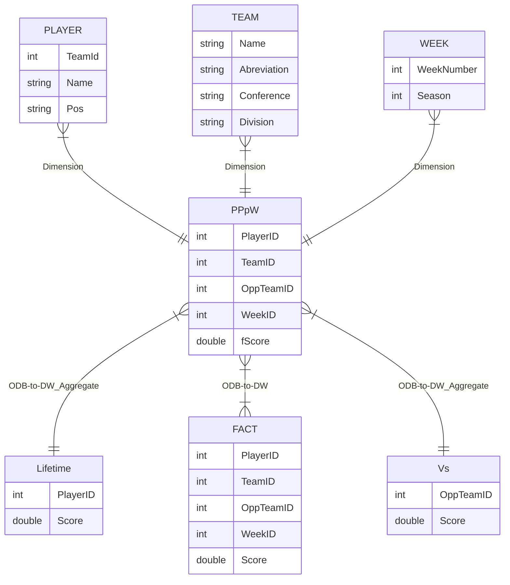

# INFSCI 1540 Project Report - American Football Quarterbacks

### What is this?
Our project provides a database of quarterback performances per game so answer questions such as: Who is the highest performing quarterback in N seasons? Which QB is the best performing average? Do I draft CJ Stroud?

### What data are we maintaining in our system?
Our data engineering system maintains a list of NFL quarterbacks over the last 4 years, their **current** teams, the games they played in, and their standard fantasy football score each game.(.04*passings yard + .1*rushing yards + 4*passing touchdowns+.6*rushing touchdowns - 2*fumbles)

We seperated games by weeks because its how NFL seasons are split and organized the weeks of the 2020-2023 seasons into 1 table so the weeks do not overlap.

Importantly, we left in a lot of "empty" data, as it in itself is it's own statistic. Using this data we can find statistics on how often players were actually played in a series, and for more specific averages per weeks/matches played.

### Our docker containers
1. Php Web Server - General DB Management
2. Mysql ODB Server - Our operational database to store our tables
3. Mysql DW Server - Our data warehouse holding onto our fact table and player performance information
4. ODB Phpmyadmin Server - Allows us to interact with the ODB sql server
5. DW Phpmyadmin Server - Allows us to interact with the DW sql server
6. Kafka Broker - Allows our producers and consumers to interact with each other
7. Zookeeper - Keeps track of our current broker and tells producers and consumers to go through our broker

### The data loading process
Our data loading process involved organizing our data to be used. Each player and team was given a table. Each week in the past 4 seasons was given its own id. We then normalized these into one table that held each player's NAME TEAM and PLAYER PERFORMANCE(fantasy score) for EACH WEEK in the past four seasons and cross referenced this against a different dataset to find which teams the player played against. Then, using kafka, we uploaded the tables to the ODB and created a new table which gave each game that was played by someone its own row. Our data warehouse would then mirror our performance per week dataset.

### Star Diagram

### Data Streaming
The data stream supported in our system was Kafka. We used it to move our data from CSVs to our ODB and our summary table to our DW.

### Pre-Aggregated Summary table
Our main summary table is the **FACT** table. We took the data through our normalized csv then PPpW table and mirrored it to create our fact table. We also made a summary table for the total points each player earned in their **Lifetime** and the total points have been scored against each team in the past 4 seasons called **Vs**.

### OLAP Queries
Player with the most 40-point games:

Every 40-point game:

Dak Prescott's Lifetime Performance:

Strongest Defensive Team:

#### Thanks for reading! Feel free to demo on your own time!
